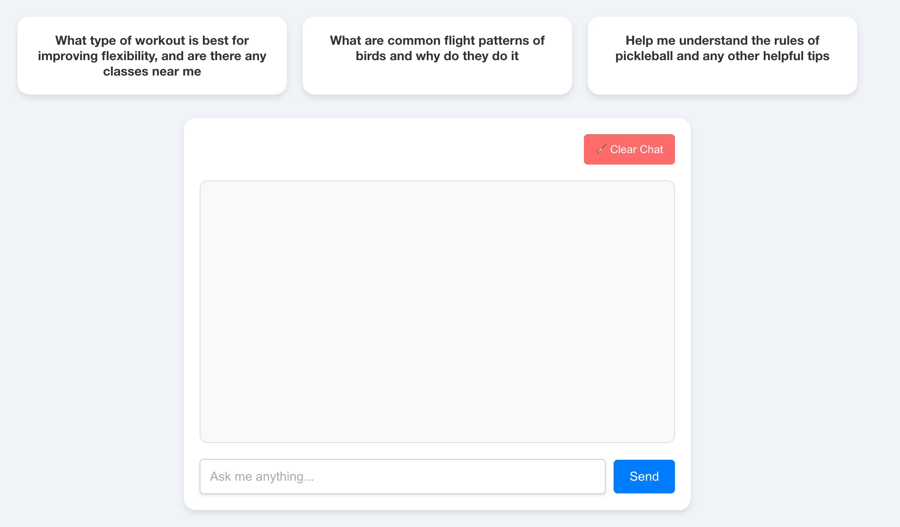

# ChatGPT Conversation Agent

This project is a customer service agent interface using ChatGPT. The user interface allows users to select predefined questions or ask their own. The interface also includes a feature to clear all previous chat messages.

## Table of Contents

- [Features](#features)
- [Prerequisites](#prerequisites)
- [Setup Environment](#setup-environment)
- [Installing Necessary Packages](#installing-necessary-packages)
- [Running the Project Locally](#running-the-project-locally)
- [Project Structure](#project-structure)
- [User Interface](#user-interface)

## Features

- **Predefined Questions:** Users can select predefined questions from the top of the interface.
- **Dynamic Chat Interface:** Users can send messages and receive responses from ChatGPT.
- **Clear Chat History:** Users can clear all previous chat messages with a single click.
- **Stylized UI:** The user interface is designed to be clean and modern.

## Prerequisites

Before you begin, ensure you have the following installed on your machine:

- [Node.js](https://nodejs.org/) (v14 or later)
- [Python](https://www.python.org/) (v3.7 or later)
- [Visual Studio Code](https://code.visualstudio.com/) (Optional but recommended)

## Setup Environment

### 1. Install Visual Studio Code (VS Code)

- **Download and Install VS Code:**
  - Go to the [Visual Studio Code website](https://code.visualstudio.com/) and download the appropriate version for your operating system.
  - Install VS Code following the installation instructions.

- **Install Required Extensions:**
  - Open VS Code and go to the Extensions Marketplace (left sidebar).
  - Install the following extensions:
    - **Python** (by Microsoft): Adds support for Python development.
    - **ESLint** (by Microsoft): For linting JavaScript/TypeScript code.
    - **Prettier - Code formatter** (by Prettier): For formatting your code.
    - **Live Server** (by Ritwick Dey): To serve your static files locally (useful for quick testing).

### 2. Install Python

- **Install Python:**
  - Make sure Python 3.7+ is installed on your system.
  - If not, download it from the [official Python website](https://www.python.org/).
  - Verify the installation by running:
    ```bash
    python --version
    ```

- **Set Up Python Virtual Environment:**
  - In VS Code, open the integrated terminal (Ctrl+`).
  - Navigate to your project directory and create a virtual environment:
    ```bash
    python -m venv venv
    ```
  - Activate the virtual environment:
    ```bash
    source venv/bin/activate  # On Windows use `venv\Scripts\activate`
    ```

### 3. Install Node.js and npm

- **Install Node.js:**
  - Download and install Node.js from the [official website](https://nodejs.org/).
  - Verify the installation:
    ```bash
    node --version
    npm --version
    ```

## Installing Necessary Packages

1. **Install Python Packages:**

    With your virtual environment activated, run:

    ```bash
    pip install flask flask-cors openai python-dotenv
    ```

2. **Install Node.js Packages:**

    Navigate to the `my-app` directory and install the required packages:

    ```bash
    cd my-app
    npm install
    ```

## Running the Project Locally

1. **Set Up Environment Variables:**

    Create a `.env` file in the root of your project directory with the following content:

    ```env
    OPENAI_API_KEY=your-openai-api-key
    ```

2. **Run the Flask Backend:**

    In the root directory of your project, with the virtual environment activated, run:

    ```bash
    python app.py
    ```

    The backend will start running on `http://localhost:5000`.

3. **Run the React Front-End:**

    Open another terminal, navigate to the `my-app` directory, and start the React development server:

    ```bash
    npm start
    ```

    The front-end will be running on `http://localhost:3000`.

## Project Structure

Here's a brief overview of the project's structure:

chatgpt-customer-service-agent/
├── app.py                    # Flask backend
├── .env                      # Environment variables
├── venv/                     # Python virtual environment
├── my-app/                   # React front-end application
│   ├── public/
│   ├── src/
│   │   ├── App.tsx           # Main React component
│   │   ├── App.css           # Styling for the React component
│   ├── package.json          # Node.js dependencies
│   ├── tsconfig.json         # TypeScript configuration
├── README.md                 # Project documentation
├── Screenshot_2024-08-16.png # User Interface screenshot


## User Interface

The user interface includes the following elements:

1. **Predefined Questions:** These are buttons located at the top of the interface. Users can click on these to automatically populate the chat input and send a predefined question to ChatGPT.

2. **Chat Box:** This is where the chat messages appear. The chat box shows both user messages and responses from ChatGPT. The box is designed with rounded corners and soft shadows for a modern look.

3. **Input Field:** Located below the chat box, the input field allows users to type their own questions. Once a message is sent, the input field is cleared.

4. **Clear Chat Button:** Positioned in the top-right corner of the chat box, this button allows users to clear the chat history with a single click.

The user interface is designed to be responsive and user-friendly, ensuring a smooth experience on various devices.

## Screenshots



---

### Notes

- Ensure your OpenAI API key is kept secure and never exposed publicly.
- This project is designed for local deployment and development. If you plan to deploy it to production, consider using a more robust setup with HTTPS and proper security configurations.
